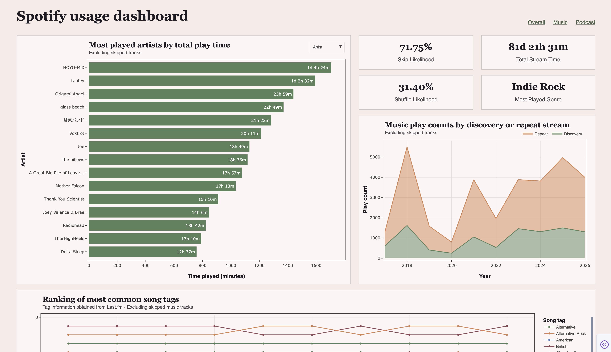

# spotify-usage-stats

Analysis on Spotify Extended Streaming History data. More information on this data, including how to obtain a personal copy, can be found in [Spotify's official support page](https://support.spotify.com/uk/article/data-rights-and-privacy-settings/).

Afterwards, create an `.env` file with the path to the data itself:

```
DATA_FILEPATH="path/to/extended/streaming/history/data"
```

> <b style='color: tomato'>Note:</b> since data represents each user's music streaming history, results in the notebook are not discussed extensively as they are subjective.


## Trends

The analysis covers stats such as:
 - General activity (weekly heatmap, time series of entire interval, breakdown by music vs podcast);
 - Yearly comparisons;
 - Discoverability vs replayability (share of music that was first played vs repeat stream);
 - Most played songs / albums / artists and podcasts
 - Most skipped songs / artists
 - Song skip streaks;
 - Song tag distributions.


## Requirements

This analysis relies extensively on [Quoi](https://github.com/jojustleft/quoi), my general toolkit for data analysis. This, as well as other dependencies can be installed locally with:

```
make venv
```

<b style='color: tomato'>Note:</b> This requires `uv` to be installed.


## Dashboard

High level stats for overall usage, as well as music and podcasts, are aggregated in a Plotly Dashboard, which can be run with:

```
make setup_dash
make dash
```

This dashboard can be run even without genre mappings. If song tag info has not been fetched, genre-related components will not be rendered.




## Track genres

Spotify's [artist information](https://developer.spotify.com/documentation/web-api/reference/get-an-artist) endpoint, which is the method for obtaining genre information on the platform, is deprecated, so for this analysis we rely on the Last.fm API instead. An account must be created and an API key stored in `.env` under the name `LAST_FM_API_KEY`.

To obtain genre information, we make API requests to the [track.getTopTags](https://www.last.fm/api/show/track.getTopTags) endpoint, with fallback to [album.getTopTags](https://www.last.fm/api/show/album.getTopTags) and [artist.getTopTags](https://www.last.fm/api/show/artist.getTopTags) if no tags are obtained. For each artist - track entry, the fallback level will be logged to give a measure of accuracy. Regarding these, it should be noted that:

1. these are tags and not strictly "genres" (may include labels such as the release year / decade);
2. there is no (simple) way to separate obtained tags into genres and subgenres;
3. artists / albums / tracks will very likely have multiple tags.

This approach is done on a per-track level. Depending on the user, there may be douzens of thousands of unique tracks to obtain genre info from, if not more. The script considers songs which have been logged at least twice by default, as it ends up filtering the long tail of the distribution without heavy impact to overall music activity. Having said that, this is a parameter which can be changed.

To obtain tag information, the following steps are needed:
 1. Create a Last.fm account;
 2. Obtain an API key and add it to .env on the `LAST_FM_API_KEY` field;
 3. Run the music tag fetch script (`make get_tags`)

The file `genre_mappings.json` should then be created on the project's root directory. Depending on the amount of tracks, running the script may take longer than an hour due to fallback mechanisms and rate limit.
